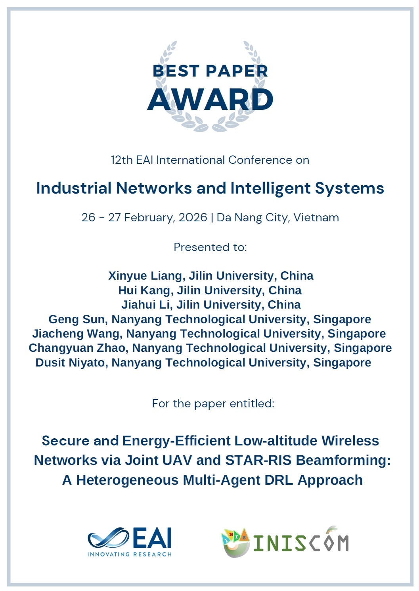
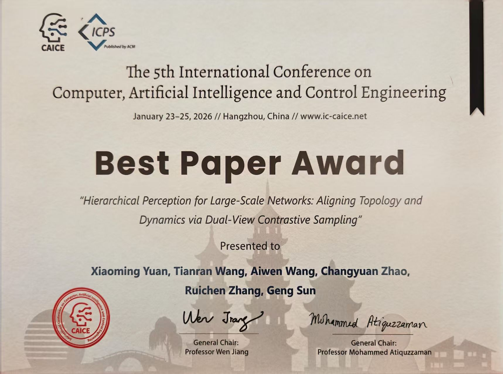
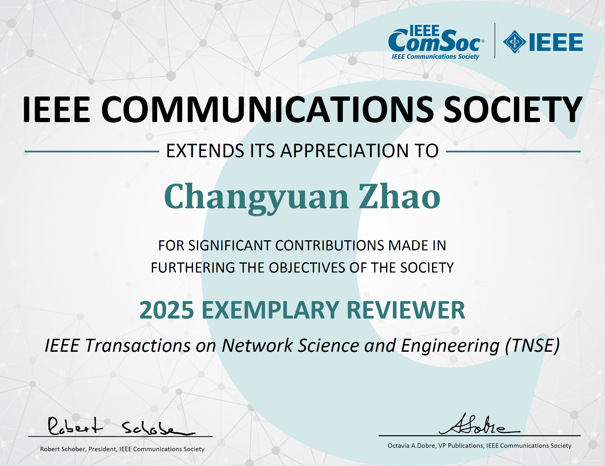
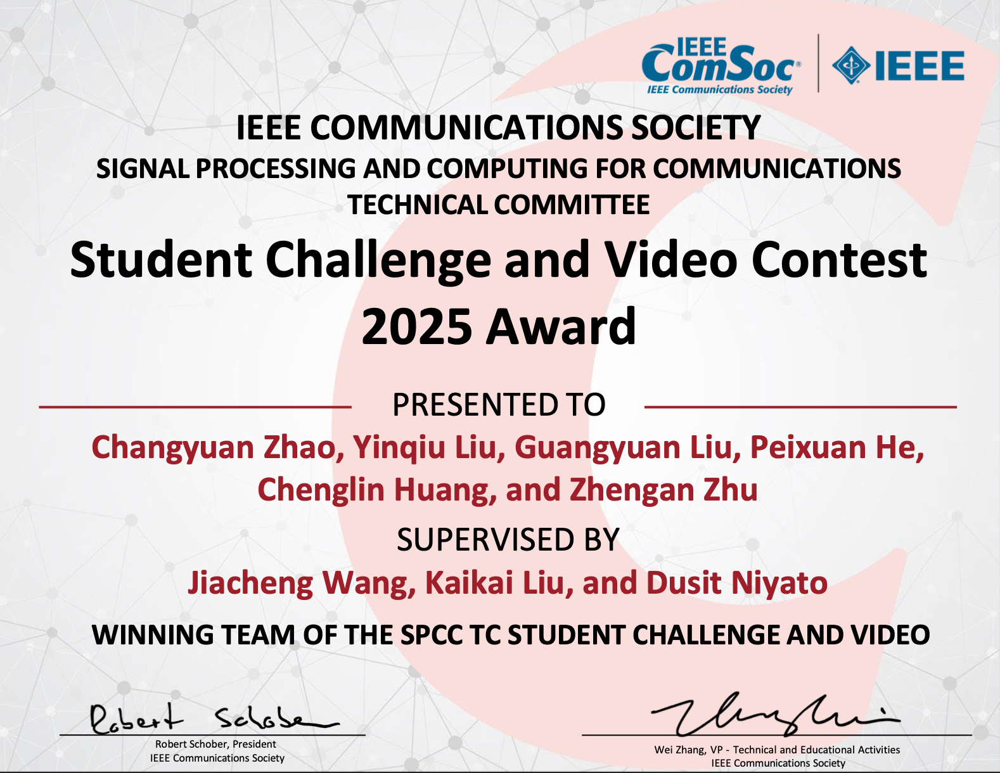
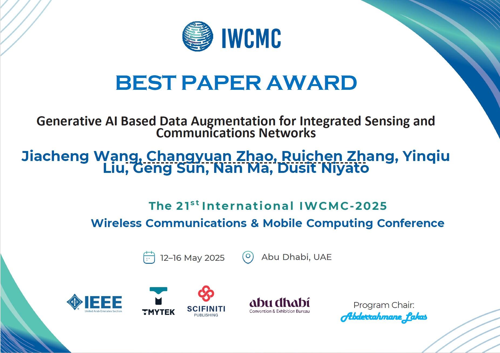
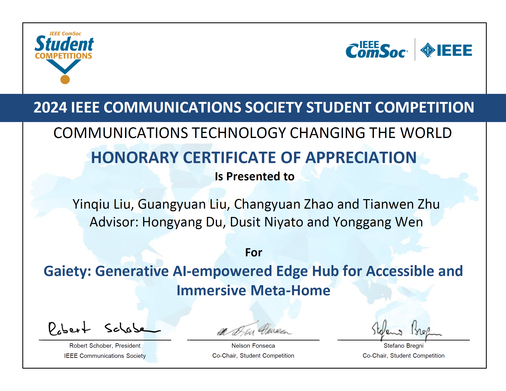

# 📖 Educations
- *Nanyang Technological University, Singapore*  
**Ph.D., Aug 2023 – Present**  
◦ Supervised by Prof. Dusit Niyato

- *University of Chinese Academy of Sciences, Institute of Software, China*  
**M.Eng., Sept. 2020 – Jun. 2023**  
◦ Supervised by Prof. Bai Xue

- *University of Science and Technology of China, China*  
**B.Sc., Sept. 2016 – Jun. 2020**  

## 🎖 Honors and Awards

- *2026.02* Best Paper Award in the *12th EAI International Conference on Industrial Networks and Intelligent Systems (EAI INISCOM 2026)* on Feb. 26-27, 2026, Da Nang City, Vietnam

- *2026.01* Best Paper Award in the *5th International Conference on Computer, Artificial Intelligence and Control Engineering (CAICE 2026)* on Jan. 23-25, 2026, Hangzhou, China

- *2025.12* Exemplary Reviewer, *IEEE Transactions on Network Science and Engineering (TNSE)*, 2025

- *2025.12* Winner in *Signal Processing and Computing for Communications (SPCC) TC Student Challenge and Video Contest* – 2025

- *2025.05* Best Paper Award in the *IWCMC 2025 Conference* on 12–16 May 2025, Marriott Hotel Downtown, Abu Dhabi, UAE

- *2024.11* One project received an Honorable Mention in the 2024 ComSoc Student Competition *"Communications Technology Changing the World"*, ranking among the top 16 out of 93 submissions.

- *2024* One project received a second silver award in the 2024 SocMeta IEEE ComSoc SNTC Student Competition.
- *2022* China National Scholarship

